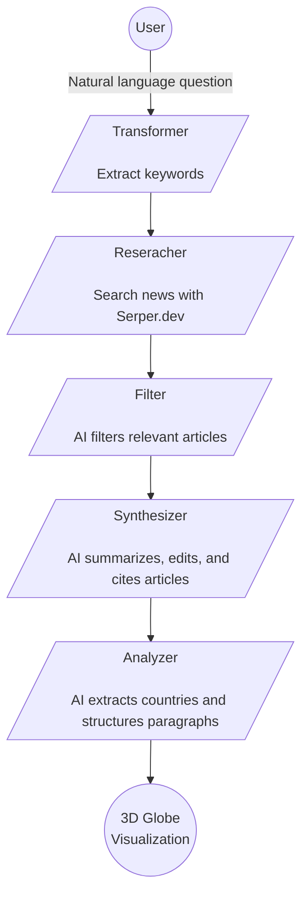

# Cartara

A geopolitical intelligence visualization tool that transforms natural language questions about world events into AI-analyzed, source-cited summaries displayed on an interactive 3D globe.

## Features

- **🌍 3D Globe Visualization** - Interactive globe with color-coded relationship arcs between countries
- **🗣️ Natural Language Questions** - Ask questions like "What's happening between Russia and Ukraine?"
- **🤖 AI Agent Chain** - Multi-step pipeline: keyword extraction, news search, relevance filtering, synthesis, and analysis
- **📚 Source Citations** - Every analysis includes cited news sources with links
- **🔗 Relationship Mapping** - Color-coded arcs show conflict (red), alliance (green), trade (yellow), tensions (orange), and diplomatic (white) relationships

## Tech Stack

- **Framework:** Next.js 15, React 19, TypeScript
- **Styling:** Tailwind CSS 4
- **3D Visualization:** react-globe.gl, Three.js
- **AI:** Vercel AI SDK with OpenRouter (flexible model selection)
- **News Data:** [Serper.dev](https://serper.dev) (Google News search)
- **Deployment:** Railway

## Getting Started

### Prerequisites

- [Node.js](https://nodejs.org/) v18+
- An [OpenRouter API key](https://openrouter.ai/keys)
- A [Serper.dev API key](https://serper.dev)

### Setup

1. **Clone and install:**

   ```sh
   git clone https://github.com/courtimusprime/Cartara.git
   cd Cartara
   bun install
   ```

2. **Configure environment:**

   ```sh
   cp .env.example .env.local
   ```

   Edit `.env.local` and add your API keys:

   ```
   OPENROUTER_API_KEY=sk-or-...
   SERPER_API_KEY=...
   ```

3. **Run locally:**

   ```sh
   cd src && bun install && bun run dev
   ```

   Open [http://localhost:3000](http://localhost:3000).

### Available Scripts

- `bun run dev` - Development server with Turbopack
- `bun run build` - Production build
- `bun start` - Production server
- `bun run lint` - ESLint
- `bun run format` - Prettier

## Architecture



All agents run as Next.js API routes (`/api/analyze`) using the Vercel AI SDK with OpenRouter for flexible, cost-optimized model selection.

## Deployment

Deployed on Railway. Set the same environment variables from `.env.example` in your Railway dashboard.

## License

MIT
