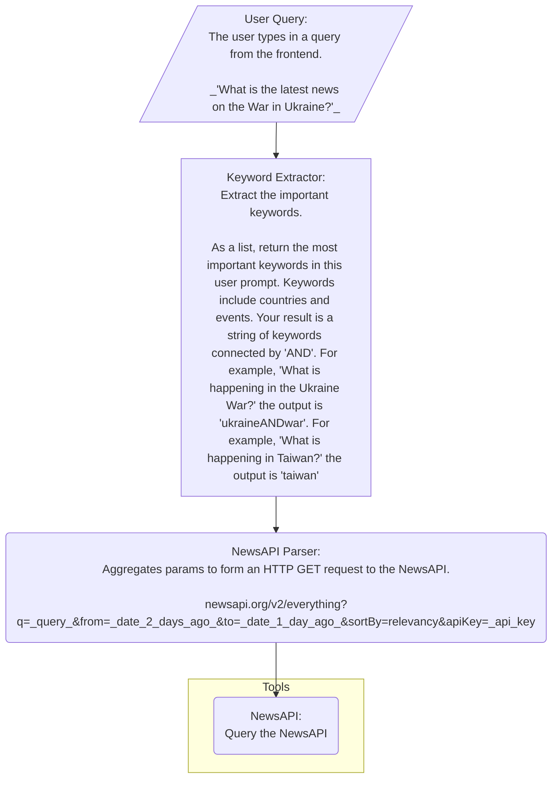

```mermaid
graph TD

query[/User Query:<br>The user types in a query from the frontend.<br><br>_'What is the latest news on the War in Ukraine?'_/]

keyword[Keyword Extractor:<br>Extract the important keywords.<br><br>As a list, return the most important keywords in this user prompt. Keywords include countries and events. Your result is a string of keywords connected by 'AND'. For example, 'What is happening in the Ukraine War?' the output is 'ukraineANDwar'. For example, 'What is happening in Taiwan?' the output is 'taiwan']

query-->keyword

parser(NewsAPI Parser:<br>Aggregates params to form an HTTP GET request to the NewsAPI.<br><br>newsapi.org/v2/everything?q=_query_&from=_date_2_days_ago_&to=_date_1_day_ago_&sortBy=relevancy&apiKey=_api_key)
subgraph Tools
    newsapi(NewsAPI:<br>Query the NewsAPI)
end

keyword-->parser

parser-->newsapi


```